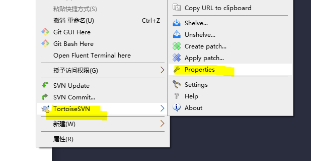
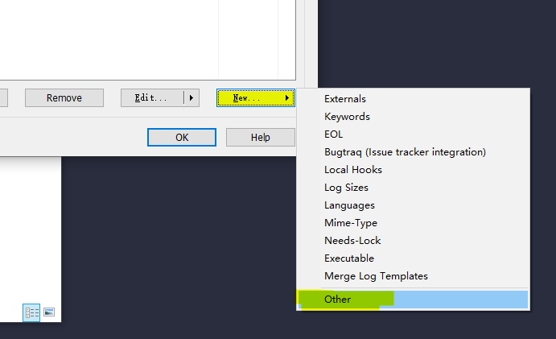
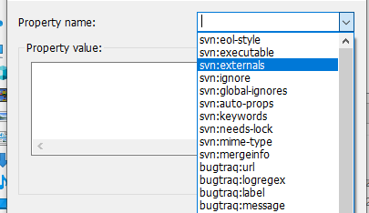
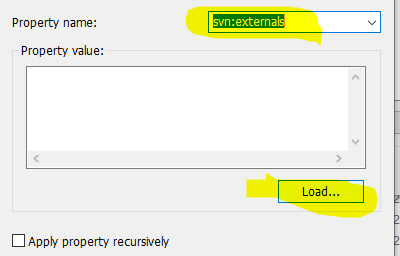

# 批量添加external

TortoiseSVN为例子

1.  
2.  
3.  
4.  

导入的文本格式


```
源   目的，subdir1 同级目录，dir根目录
../dir/subdir1/subdir2       subdir1/subdir2                  
../dir/subdir1/subdir2       subdir1/subdir2                 
../dir/subdir1/subdir2       subdir1/subdir2                     
```

